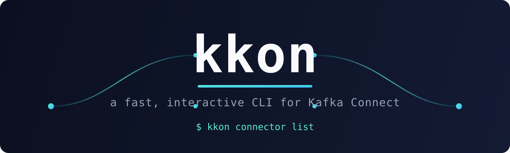

<div align="center">
  
</div>

<div align="center">

[](https://github.com/Maksim-Gr/kkon/actions/workflows/go.yml)
[](https://goreportcard.com/report/github.com/Maksim-Gr/kkon)
[](https://github.com/Maksim-Gr/kkon/blob/main/go.mod)
[](https://github.com/Maksim-Gr/kkon/releases)
[](https://pkg.go.dev/github.com/Maksim-Gr/kkon)

</div>

---

A command-line interface for managing Kafka Connect connectors via the Kafka Connect REST API.
`kkon` focuses on providing a fast, simple, and interactive CLI experience for day-to-day connector operations.

<div align="center">
  
</div>

---

## Overview

`kkon` is a Go-based CLI tool designed to interact with Kafka Connect clusters.
It creates a lightweight client for the Kafka Connect REST API and exposes common connector management operations through an intuitive command-line interface.

The tool is intended for developers and operators who want a straightforward way to list, inspect, back up, create, and delete connectors without manually interacting with REST endpoints.

---

## Features

- List running Kafka Connect connectors with live status badges (RUNNING / FAILED / PAUSED)
- View connector configurations
- Create connectors from predefined templates (RabbitMQ, S3 Sink, JDBC, Debezium Postgres), from **any plugin installed on the cluster** (`--plugin <class>` or the `Custom` wizard option — discovers required fields via the validate endpoint), or from a JSON file
- Pause, resume, restart, and delete connectors individually, by name, or in bulk (`--all` or a multi-select) — bulk runs continue past individual failures and print a per-connector ✓/✗ summary
- Update connector configuration with a before→after diff view
- Back up connector configurations to JSON files, and restore them later (continues past individual failures, exits non-zero if any restore failed)
- Health-check with per-task error trace preview for failed tasks
- Interactive CLI prompts (arrow-key navigation, cancel option on every prompt)
- Connection test after saving credentials
- Basic auth support
- Simple configuration-driven setup, with `KKON_*` environment variable overrides for CI
- Scriptable: commands exit `1` on failure (`0` for success, user cancel, or nothing to do), and `--output json` produces clean, pipeable JSON for both read and (fully non-interactive) mutating commands, including `--dry-run` previews

---

## Installation

### Download a release (recommended)

Download the latest binary for your platform from the [Releases](https://github.com/Maksim-Gr/kkon/releases) page, then make it executable:

```bash
chmod +x kkon
mv kkon /usr/local/bin/kkon
```

### Install with Go

```bash
go install github.com/Maksim-Gr/kkon@latest
```

### Build from source

```bash
git clone https://github.com/Maksim-Gr/kkon.git
cd kkon
go build -o kkon
```

---

## Configuration

On first run `kkon` will prompt you to configure a Kafka Connect endpoint.
You can also run configuration manually at any time:

```bash
kkon config set
```

Config file location:

| Platform | Path |
|----------|------|
| Linux / macOS | `~/.config/kkon/config.yaml` |
| Windows | `%USERPROFILE%\.config\kkon\config.yaml` |

Example config:

```yaml
kafkaConnect:
  url: http://localhost:8083
  username: ""
  password: ""
```

### Environment variables

`KKON_CONNECT_URL`, `KKON_CONNECT_USERNAME`, `KKON_CONNECT_PASSWORD`, and `KKON_SCHEMA_REGISTRY_URL` override the config file. With `KKON_CONNECT_URL` set, no config file or interactive setup is needed — handy in CI:

```bash
KKON_CONNECT_URL=http://connect:8083 kkon connector health-check --output json
```

---

## Usage

```bash
kkon --help
```

### Connector commands

```bash
kkon connector list                      # List connectors with status badges
kkon connector create                    # Create from template (RabbitMQ, S3 Sink, JDBC, Debezium Postgres)
kkon connector create --plugin <class>   # Create from any plugin installed on the cluster
kkon connector create -f connector.json  # Create from JSON file
kkon connector update                    # Update connector config (shows before→after diff)
kkon connector delete [name...]          # Delete one or more connectors (interactive multi-select, names, or --all)
kkon connector delete my-conn --yes      # Delete without the confirmation prompt (scriptable)
kkon connector pause [name...]           # Pause connectors and their tasks
kkon connector resume [name...]          # Resume paused connectors
kkon connector restart [name...]         # Restart connectors (and their tasks)
kkon connector restart [name] --only-failed     # Restart only FAILED connector and tasks
kkon connector restart --all --yes       # Restart every connector, skipping confirmation
kkon connector health-check              # Show connector and task statuses with error traces
kkon connector plugins                   # List connector plugins installed on the cluster
kkon connector plugins --type sink       # Filter plugins by type (source or sink)
kkon connector backup                    # Back up all connector configs to JSON
kkon connector restore [file]            # Restore connectors from a backup file (interactive if omitted)
```

> `delete`, `pause`, `resume`, and `restart` take optional connector names — omit them to multi-select interactively, or pass `--all` to target every connector. All four accept `--yes/-y` to skip the confirmation prompt (for scripting); `pause`/`resume` only confirm when targeting more than one connector. Operating on multiple connectors continues past individual failures, prints a per-connector ✓/✗ summary, and exits `1` if any operation failed. `restart` restarts tasks by default (`--include-tasks`); use `--only-failed` to restart only failed connectors/tasks.

### Task commands

```bash
kkon task list -c <name>      # List tasks for a connector
kkon task get  -c <name>      # Get task status
kkon task restart -c <name>   # Restart a task
```

### Config commands

```bash
kkon config set               # Set Kafka Connect URL and credentials
kkon config show              # Display current configuration
```

### Global flags

```bash
--dry-run, -d        Preview a mutating command without executing it (read-only commands ignore it)
--output, -o <fmt>   Output format: text (default) or json
```

Exit codes: `0` for success, user cancel, or nothing to do (e.g. no connectors found); `1` for any failure.

---

## Backup Example

The `backup` command retrieves all connector configurations from the Kafka Connect cluster and stores them in a timestamped JSON file:

```bash
kkon connector backup --dir ./backup
```

This allows connector configurations to be versioned, reviewed, or restored later.

Restore them with:

```bash
kkon connector restore ./backup/config_20240101_120000.json
```

Run `kkon connector restore` with no argument to pick a backup file interactively from the backup directory. Existing connectors are only overwritten after confirmation (use `--yes` to skip prompts, or `--dry-run` to preview). Restoring continues past individual failures, prints a per-connector ✓/✗ summary, and exits `1` if any connector failed to restore.

---

## Roadmap

- Additional connector templates
- Table output format (`--output table`)

---

## Project Status

`kkon` is stable and actively used for connector lifecycle management.
Releases follow semantic versioning; new connector templates and API features are added in backward-compatible minor releases, and breaking changes (e.g. exit code behavior in v2.0.0) bump the major version.

---

## Contributing

Contributions, bug reports, and feature requests are welcome.

- Check open issues before submitting a duplicate
- Fork the repository and open a pull request against `main`
- Follow the existing code style (`gofmt`, `go vet`)
- Integration tests require Docker; run `make test`

---

## References

- Kafka Connect REST API documentation:
  https://docs.confluent.io/platform/current/connect/references/restapi.html
